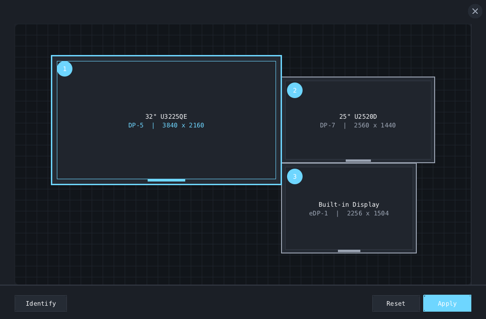

# Display Layout Editor

A focused drag-and-drop display layout editor. It provides a sparse, spatial workflow without turning display placement into a full settings dashboard.



Display Layout is an independent project. NVIDIA is not affiliated with, does not endorse, and does not own this project. No NVIDIA source code, artwork, trademarks, or other proprietary assets are included, and no infringement of or ownership claim over NVIDIA's works is intended or implied.

## Status

The initial release supports niri. The UI and layout model do not depend on niri: compositor and display-server integration lives behind the `DisplayBackendOps` interface. A Sway, Wayland-protocol, or XRandR backend can be added without changing the application UI.

## Features

- Logical-pixel, to-scale display previews
- Drag-and-drop placement with proximity snapping for edges and centerlines
- Animated alignment guides while displays line up horizontally or vertically
- Reset, close, and atomic user-confirmed apply workflow
- Numbered output badges plus simultaneous, per-output identification overlays
- Dark and light themes
- Pixel- or percentage-based default window dimensions
- Configurable font, font size, and snap distance
- Small C codebase and runtime closure

## Run

```console
nix run github:johnrichardrinehart/display-layout
```

Or build locally:

```console
nix build
./result/bin/display-layout
```

## Configuration

Copy [`config.example.ini`](config.example.ini) to `$XDG_CONFIG_HOME/display-layout/config.ini` (normally `~/.config/display-layout/config.ini`). The application never creates or rewrites its configuration automatically.

Dimensions independently accept pixels or percentages:

```ini
width = 1060px
height = 87%
font-size = 16
# font = /path/to/a/monospace-font.ttf
theme = system
snap-distance = 14
identify-duration-ms = 2000
backend = auto
```

Use `theme = dark`, `light`, or `system`. System mode checks common desktop and GTK preferences and falls back to dark. An explicit config can be selected with `--config PATH`, and a backend can be selected with `--backend NAME`.

## Backend architecture

The generic application owns rendering, interaction, configuration, and the display layout model:

- `src/main.c` — backend-independent UI and interaction
- `src/model.h` — backend-neutral display data
- `src/backend.h` / `src/backend.c` — backend contract and selection
- `src/backend_niri.c` — niri IPC discovery and apply implementation
- `tests/backend_niri_test.c` — niri-specific parser tests

A backend implements only `load`, `apply`, and lifecycle operations. Niri support invokes `niri msg` directly without shell interpolation and parses its JSON response in-process.

## Development

The flake follows the same dev-input partitioning used by the author's other projects. Consumer evaluation does not fetch development-only inputs.

```console
direnv allow
nix flake check
```

Development tooling uses:

- flake-parts
- treefmt-nix
- nix-direnv
- git-hooks.nix
- clang-format

## License

MIT. The vendored `jsmn` parser retains its own MIT license notice in `src/third_party/jsmn.h`.
